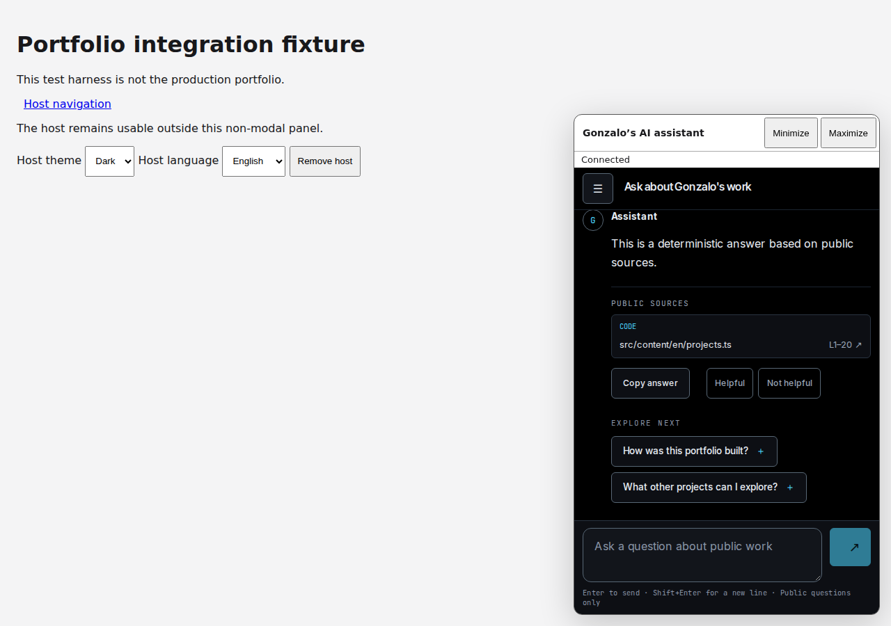
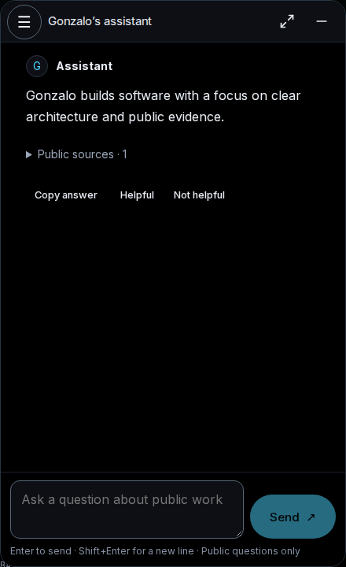
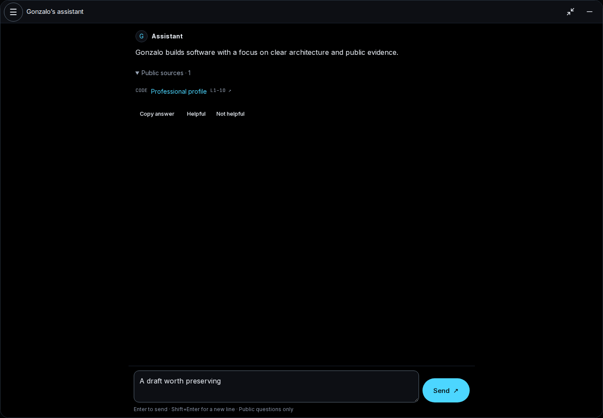
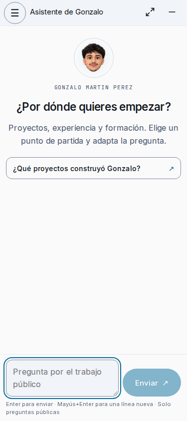
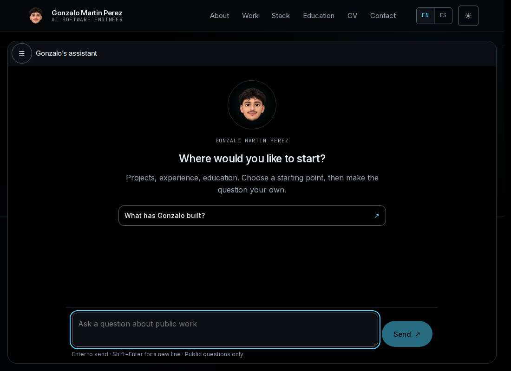

# Native assistant verification

Test environment: WSL Linux, Node 24.21.0, npm 11.19.0, Next.js 16.3.8,
React 19.3.0, TypeScript 7.0.2 and Playwright 1.63.0. Tests use an isolated
production server behind a loopback HTTPS fixture. OpenSSL is a test prerequisite;
only Playwright ignores the ephemeral self-signed certificate. Browser fixtures call the real HTTP/SSE
adapter and controller, but do not call OpenAI or prove production CORS/cookies.

An additional browser smoke exercised the committed API at
`https://localhost:18118` from `https://localhost:3264`, without request interception.
Chromium, Firefox and WebKit passed session bootstrap, Secure/HttpOnly cookies,
credentialed cross-origin requests, CSRF, public catalog, SSE, source links,
durable reload/history and conversation deletion. The backend used its isolated
fixture provider and databases, not OpenAI. Each browser deleted its own test
conversation. This proves local HTTPS integration, not production routing or
provider answer quality.

The fixture used API revision `c6012067c4a99db477bb6ddcf1f26dae095641ca`
and corpus revision `cb0b56baaa50a1521a4e02eee1d67f13c89d19a2` (version
`cb0b56baaa50a1521a4e02eee1d67f13c89d19a2-v6`). The API owner built image
`sha256:b724a3c322304ee024bfd0e42a02749f6c479566d12a35a594e9b95ca59a250b`
from a committed Git archive, with migrations 001–005, isolated PostgreSQL/pgvector
and Neo4j, and no Redis. Its bounded fixture index contained 12 public files,
75 chunks and 268 graph facts; this is not a full production corpus evaluation.

## Evidence and reproduction

```sh
npm ci
npm run contract:generate
npm run check
npx playwright test tests/browser/assistant.spec.ts
```

`contract:generate` installs the independent frozen generator lockfile. The
primary and scoped strict checks use TypeScript 7; only the generator's
programmatic compiler peer remains TypeScript 5.9.3.

The verification includes 23 repository checks, 31 assistant unit/network checks,
32 content checks, identity/document validation, 19 rendered-route checks, the production smoke test,
Biome, both type configurations,
the production build and nine build-budget checks. Native browser coverage is
17 scenarios in Chromium desktop/mobile, Firefox and WebKit: **68 passed in
4.1 minutes**, with two workers and no retries. The managed server stopped both
owned listeners and removed its ephemeral TLS directory after the run. These scenarios
cover sources, persistence, rename/delete, guarded clipboard writes, rejected
unsafe content, IME, rapid stop, failure/recovery, theme/locale, scrolling,
minimize/navigation continuity and motion. Physical devices and screen readers
remain separate verification steps.

An additional keyboard walkthrough performed 20 successive Tab advances in the
mobile modal and verified focus stayed inside it; Escape restored launcher focus.
The visual walkthrough inspected the screenshots below and corrected a skip link
that initially overlapped the consolidated toolbar.

## Actual screenshots

The historical screenshot comes from frontend revision
`aed8ea710c8b847ddc9066aaef5ce48d3793b494`; it documents the former iframe
presentation, not an equal-environment performance baseline. New screenshots
show deterministic public fixture content, never personal visitor messages.












The local pointer/tap/rest recording is retained under `.artifacts/native-demo/`;
that ignored artifact is not a production feature or a published recording.

## Transfer and coverage mapping

| Former frontend responsibility | Native portfolio responsibility |
| --- | --- |
| `src/features/assistant/domain` and `application` | Same feature layers with existing lifecycle and transport ports |
| HTTP/SSE adapters and runtime guards | `src/features/assistant/adapters`, plus validated public starter catalog |
| Message, Markdown, copy, composer and avatar | Shared feature presentation using owned portfolio buttons/tokens/avatar |
| Standalone and embedded shells | Stable root-layout host and `/assistant` / `/es/assistant` |
| Chat browser actions and failure coverage | `tests/browser/assistant.spec.ts` and actual adapter fixtures |
| State, SSE and transport checks | `scripts/assistant-{state,sse,transport,network}.test.ts` |
| API provenance | `src/contracts/source.json` and contract integrity checks |
| Frame/postMessage protocol | Retired for the native architecture; no browser credentials cross a messaging protocol |

The imported API revision is `c6012067c4a99db477bb6ddcf1f26dae095641ca`,
with contract artifact handoff `15b6943f741ac80498a5fee611aa74d24250eb6b`.
No mutable API working tree was consumed.

### Reproduce the cross-service smoke

Provision an isolated, committed fixture-provider API with no OpenAI credentials.
Its HTTPS wrapper must permit the exact browser origin below and expose the
session/CSRF/SSE contract. The API owner supplies that environment; this repository
does not start or modify another agent's services. Build the public origin into
the frontend, then start its test-only HTTPS wrapper in a separate terminal:

```sh
NEXT_PUBLIC_ASSISTANT_API_URL=https://localhost:18118 npm run build
BROWSER_TEST_PORT=3264 BROWSER_TEST_UPSTREAM_PORT=3265 node scripts/browser-test-server.ts
```

Once the managed wrapper is ready:

```sh
ASSISTANT_API_FIXTURE=1 SITE_TEST_ORIGIN=https://localhost:3264 \
  ASSISTANT_API_TEST_ORIGIN=https://localhost:18118 node tests/integration/native-api.ts
```

The smoke requires an explicit fixture acknowledgement and HTTPS localhost
origins; it does not bypass authorization for a model-backed environment.
Stop the owned wrapper with Ctrl+C afterward. Rebuild without the local origin
before running the mocked browser suite. The first local-origin build exited
with Node status 139 during trace collection after successful compilation/types;
the identical retry completed successfully. The first build failure's root cause
remains unverified; it is not reported as a successful build or an application
performance improvement.

## Measured build impact

Final build: 2,789 bytes gzip deferred assistant CSS; 23,137 bytes gzip existing
portfolio CSS; 25,926 bytes gzip total CSS. The assistant JavaScript dependency
closure is 58,516 bytes gzip. The compilation graph reports one lazy root and
`initial: false`; browser tests assert no API initialization before activation.
The existing 24 KiB CSS budget remains unchanged, with an explicit reviewed
4 KiB allowance for the new deferred feature. Every non-scene client chunk
remains within the existing 80 KiB limit.

The final incremental build compiled in 6.7 seconds and checked types in
1.058 seconds under concurrent local work. These are observed timings, not a
controlled speed improvement or field Core Web Vitals claim.

## Remaining integration checks

The API and vps-ops owners must verify exact allowed portfolio origins, credentialed
CORS, cookie policy, exposed `X-Run-ID`, CSRF and reverse-proxy SSE behavior.
Provider quality, production headers/TLS, physical mobile
keyboards and assistive technology have not been established by these fixture tests.
No deployment or production authentication change is authorized by this document.
